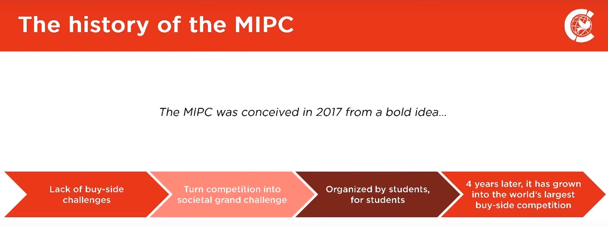
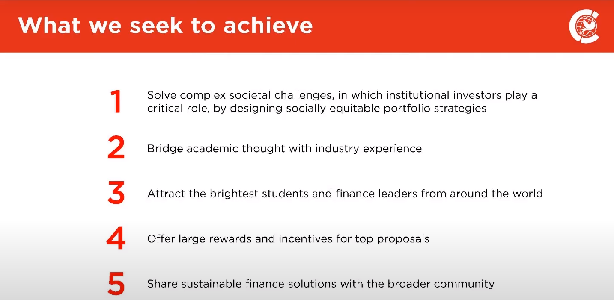
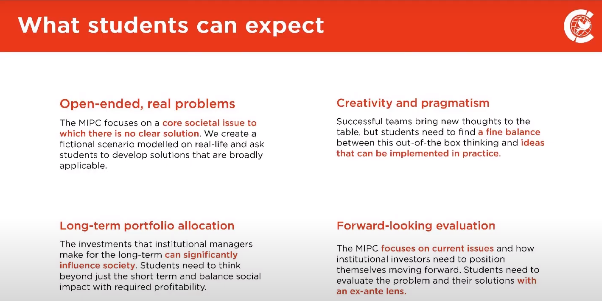
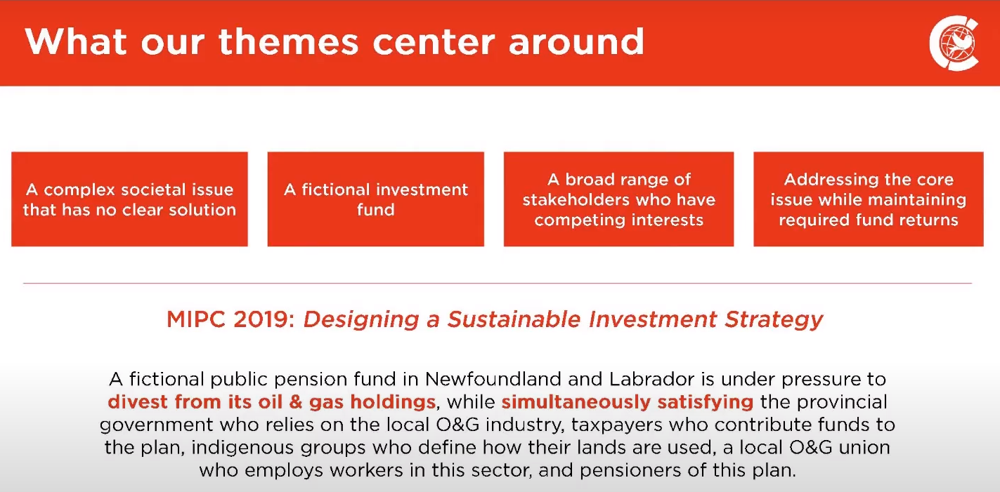
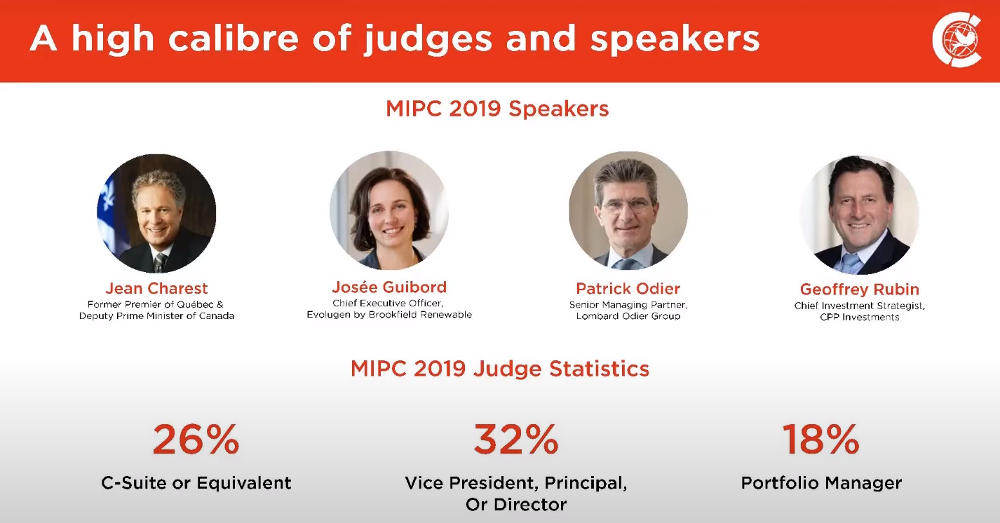
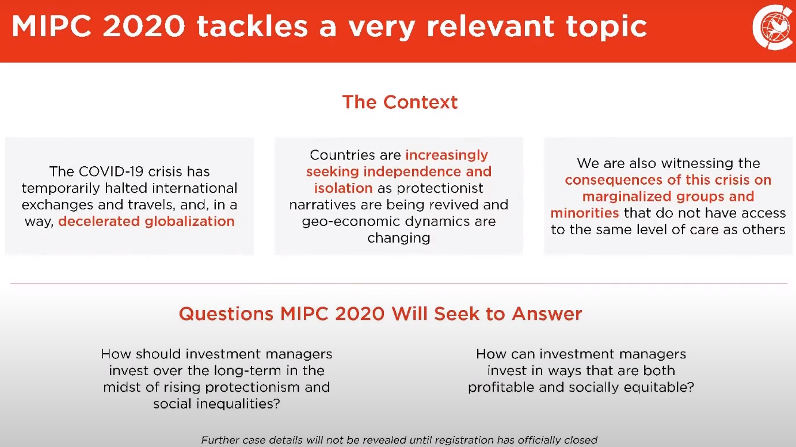
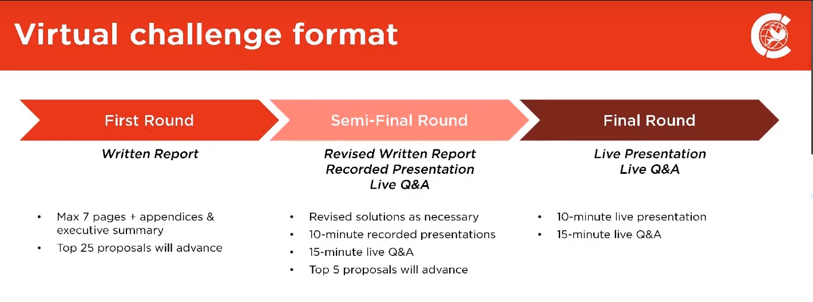
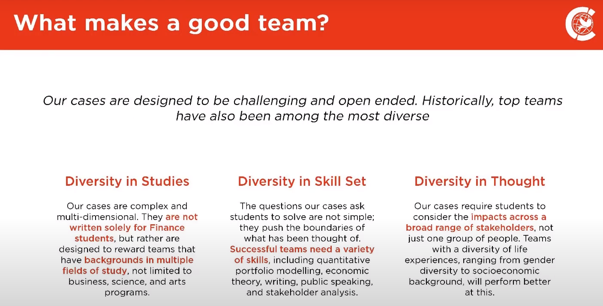
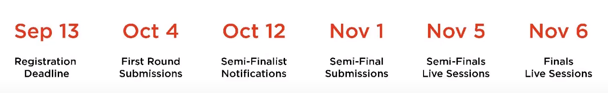
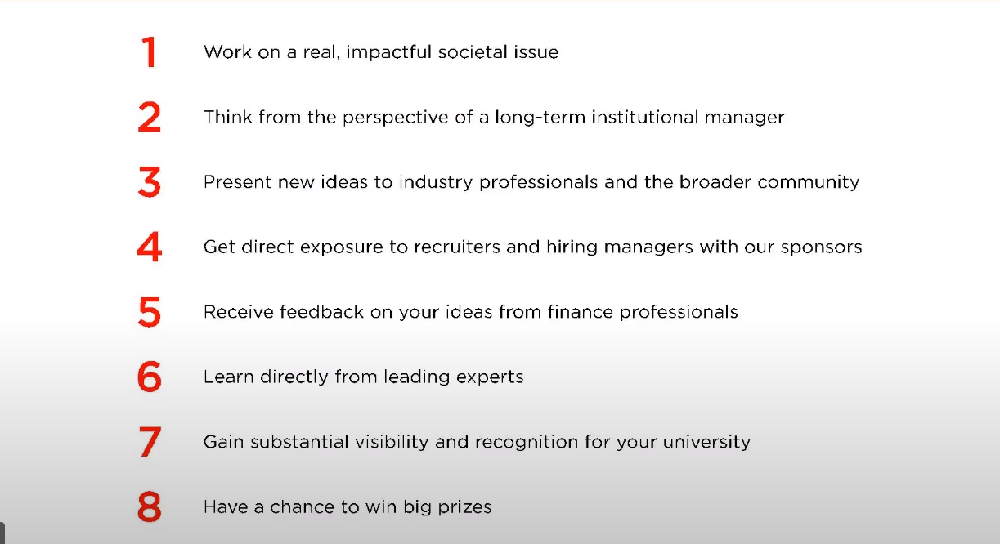

# EDHEC_MIPC
This is mainly for MIPC competition

----------
# MIPC

[Official Introduction](https://mipc.ca/info-session-video/://github.com)
## History

1. **buy-side competition**
2. last year 90 teams

## Aims

How can finance managers create a **long-term** portfolio that addresses **societal grand issues** (e.x. retirement shortfall, climate change)

### keywords:
- sustainable finance
- long term portfolio decision
- societal issue

## Expectation from students' side

### keywords
- develop broadly applicable solution/ creative and pragmatic
- not only good for funds, but also have a good impact on environment
- **think more than profitability aspect**
- will be evaluated on a forward-looking basis

## Theme

### MIPC 2019

### MIPC 2020

## Format

## What makes a good team

## Time Line

## What one could get from this competition

----------------------
# What's Next?

**Think about Covid-19, model without considering covid-19 will no doubt fail**

-----------------------
# 备注
很好的NETWORK的机会，可以把简历给赞助者，今年所有参赛者都可以交简历给赞助者
